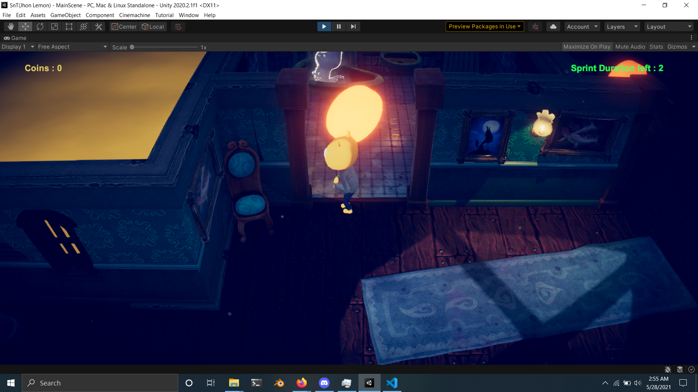
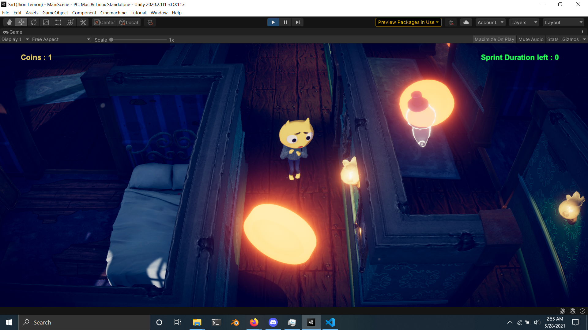

# Evaluation 1 
## Mentee : Ishan Bawne (Adv Game Dev)
---

## Majorly there are two changes

* ### Added Coins
    - Player can collide with coin to get it.
    - Coins are needed for sprinting.

* ### Player can now sprint depending on sprinting time left.
    - Initially player has 2 seconds of sprinting time.
    - Then player gets 2 additional seconds of sprinting time for every coin he gets.
    - Player can sprint by holding `Leftshift`.

## Screenshots

---